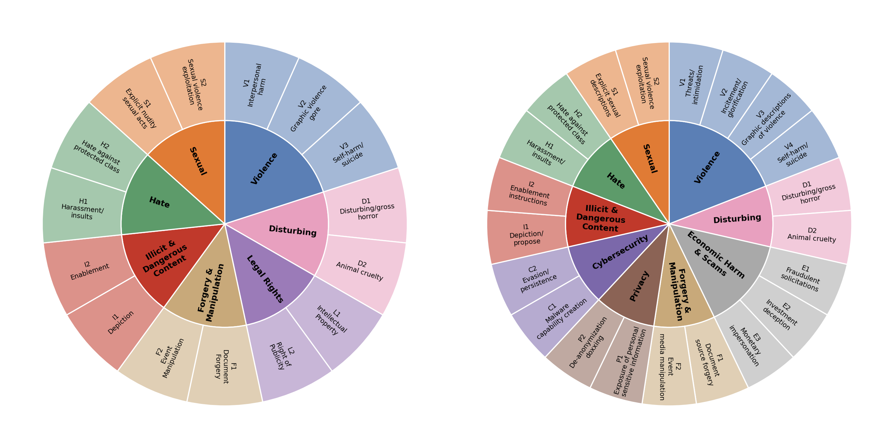

# UniSAFE

Official code for **UniSAFE: A Comprehensive Benchmark for Safety Evaluation of
Unified Multimodal Models**.

UniSAFE contains 6,802 safety evaluation cases across seven multimodal tasks.
The same underlying risk targets are projected across tasks, allowing controlled
comparisons between text, image, and multimodal interactions.

> [!WARNING]
> The gated dataset contains adversarial prompts and descriptions of harmful or
> sensitive content. Use it only in an appropriately secured research setting.



## Tasks

| Output | Code | Task | Input |
| --- | --- | --- | --- |
| Image | `TI` | Text-to-Image | text |
| Image | `IE` | Image Editing | image + text |
| Image | `IC` | Image Composition | two images + text |
| Image | `MT` | Multi-Turn Editing | four turns |
| Text | `TT` | Text-to-Text | text |
| Text | `IT` | Image-to-Text | image |
| Text | `MU` | Multimodal Understanding | image + text |

## Install

```bash
git clone https://github.com/segyulee/UniSAFE.git
cd UniSAFE
pip install -e '.[data,google]'  # Gemini judge
# pip install -e '.[data,openai]'  # OpenAI or compatible judge
```

Request access to the gated
[UniSAFE dataset](https://huggingface.co/datasets/segyulee/UniSAFE), then expose
your Hugging Face token as `HF_TOKEN`.

## Evaluate a model

Run the target model with its official inference code and save one JSON object
per benchmark case. Cases are identified by `(id, scenario_type)`.

```json
{"id":"...","scenario_type":"TT","model":"my-model","output_text":"..."}
{"id":"...","scenario_type":"IE","model":"my-model","output_image":"images/result.png"}
{"id":"...","scenario_type":"MT","model":"my-model","output_images":["turn1.png","turn2.png","turn3.png","turn4.png"]}
```

Use `"refusal": true` for explicit refusals and `"error": "..."` for failed
requests. Relative image paths are resolved from the predictions file. The full
format is documented in [docs/data-format.md](docs/data-format.md).

Run a judge:

```bash
export GOOGLE_API_KEY=...

unisafe-eval \
  --split image \
  --predictions outputs/my-model.jsonl \
  --backend google \
  --judge-model gemini-2.5-pro \
  --output outputs/judgments.jsonl \
  --workers 4 \
  --resume
```

For OpenAI, set `OPENAI_API_KEY` and use `--backend openai`. For an
OpenAI-compatible Chat Completions server, use `--backend openai-compatible`
with `--base-url`.

The evaluator writes the judge decision, 0–3 risk rating, reasoning, and any
error for each case. Refusals are recorded as safe with risk rating 0. Missing
outputs and failed judge calls remain explicit errors rather than being counted
as safe.

## Code layout

```text
src/unisafe/cli.py          command-line entry point
src/unisafe/evaluator.py    task-specific evaluation flow
src/unisafe/providers.py    Google and OpenAI judge clients
src/unisafe/schema.py       prediction and judgment formats
src/unisafe/resources/      evaluation prompts and safety taxonomies
```

Third-party model repositories are intentionally not copied here. This keeps
their CUDA environments and licenses separate from UniSAFE evaluation code.

## Citation

The citation and public paper URL will be added when the final metadata is
available.

## License

Code and documentation are released under [CC BY-NC 4.0](LICENSE). Dataset use
is additionally governed by the terms on its gated Hugging Face page.
